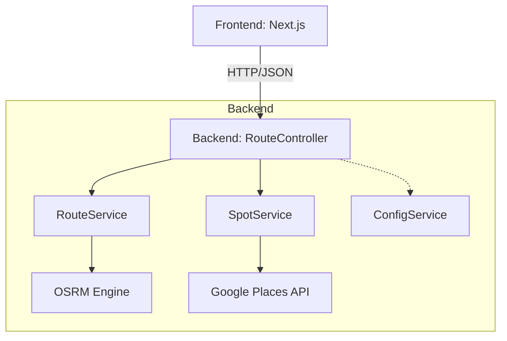

# 最終実装クリーンアップ・仕上げ作業計画書

本ドキュメントは、サイクリングルート生成アプリケーションの最終仕上げに向けた、ハードコーディングの解消、ダミーロジックの排除、リファクタリング、およびテスト拡充の計画をまとめたものです。

## 1. 目的
実装済みのコードベースを徹底的に見直し、本番運用に耐えうる堅牢性とメンテナンス性を確保する。

## 2. 洗い出された課題と対応方針

### 2.1 動的情報のハードコーディング解消
| 箇所 | 現状 | 対応方針 |
| :--- | :--- | :--- |
| Backend (`main.cc`) | ポート `8080`, CORS Origin `*` | `ConfigService` を拡張し、環境変数から取得可能にする。 |
| Backend (`SpotService.cc`) | Google Maps API URL, Endpoint, Search Params | 定数クラス、または `ConfigService` での管理に移行する。 |
| Frontend (`constants.ts`) | デフォルト座標, プレースホルダ比較 | 座標も環境変数/設定ファイル化し、APIキーチェックを厳密にする。 |

### 2.2 ダミーロジック・データの正式実装化
| 箇所 | 現状 | 対応方針 |
| :--- | :--- | :--- |
| `SpotService` (Search) | ルートの「中間地点1箇所」のみ検索 | ルート全体（ポリライン）を分割し、複数地点で検索を行うロジックを実装。 |
| `ConfigService` (Path) | デフォルトファイルパスがコード内に存在 | パスが見つからない場合のエラーハンドリングを強化し、明確なエラーを出す。 |

### 2.3 疎結合化とリファクタリング
| 箇所 | 現状 | 対応方針 |
| :--- | :--- | :--- |
| Backend Controllers | コンストラクタ内でサービスを `new` している | コンストラクタ注入（DI）を徹底し、インターフェースへの依存に変更する。 |
| Frontend `page.tsx` | 400行超え。UIとロジックが混在。 | `ControlPanel`, `MapContainer`, `ResultStats` 等にコンポーネントを再分割する。 |

### 2.4 テストコードの拡充
| 対象 | 内容 |
| :--- | :--- |
| `SpotService` | HTTPクライアントをモック化し、外部APIに依存しないユニットテストを追加。 |
| `useRoute` (Hook) | 各種パラメータ入力時の振る舞い、エラー時の状態遷移をテスト。 |
| Integration | フロントエンドとバックエンド間の通信（モックAPIを使用）の疎通テスト。 |

## 3. 作業工程

### Phase 1: バックエンドの堅牢化 (Code Mode)
- [ ] `ConfigService` の拡張（ポート、CORS、外部API設定の追加）
- [ ] `SpotService` の検索ロジック改善（マルチポイント検索の実装）
- [ ] 依存性注入（DI）パターンの適用によるコントローラーのリファクタリング

### Phase 2: フロントエンドの整理 (Code Mode)
- [ ] `page.tsx` のコンポーネント分割
- [ ] 定数管理の整理と環境変数の活用強化

### Phase 3: テストの追加と最終確認 (Debug/Code Mode)
- [ ] バックエンドのモックテスト追加
- [ ] フロントエンドのフック/コンポーネントテストの追加
- [ ] 全体的な動作確認とログ出力の整理

## 4. システム構成図 (疎結合化後)

---
作成日: 2025-12-25
作成者: Roo (Architect Mode)
